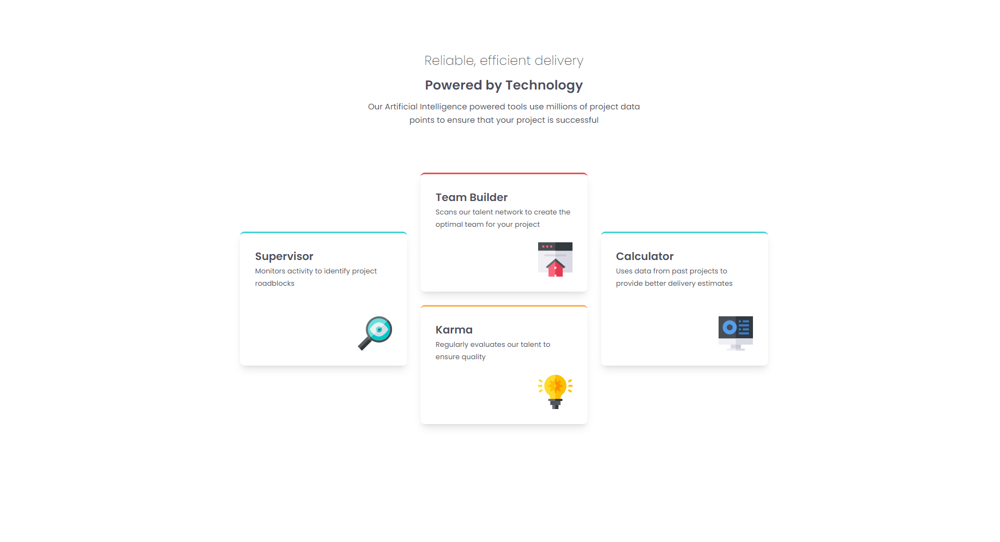

# Frontend Mentor - Four card feature section solution

This is a solution to the [Four card feature section challenge on Frontend Mentor](https://www.frontendmentor.io/challenges/four-card-feature-section-weK1eFYK). Frontend Mentor challenges help you improve your coding skills by building realistic projects.

## Table of contents

- [Overview](#overview)
  - [Screenshot](#screenshot)
  - [Links](#links)
- [My process](#my-process)
  - [Built with](#built-with)

## Overview

### Screenshot

### Links

- Solution URL: [https://www.frontendmentor.io/solutions/a-response-social-profile-card-with-hover-effects-9P5nhV55RQ](https://www.frontendmentor.io/solutions/a-response-social-profile-card-with-hover-effects-9P5nhV55RQ)
- Live Site URL: [https://famous-marzipan-e8b86e.netlify.app](https://famous-marzipan-e8b86e.netlify.app)

## My process

### Built with

- Semantic HTML5 markup
- CSS custom properties
- Flexbox
- Mobile-first workflow
- Hover/Focus states
- Transitions
